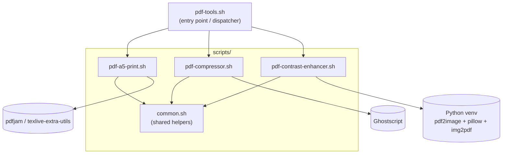

## What this is

A collection of small interactive bash scripts for common PDF tasks (A5→A4 imposition, Ghostscript compression, contrast/sharpness enhancement). No build system, no package manager, no automated test suite — everything is plain bash plus a small embedded Python script for the contrast tool.

## Running / verifying changes

There's no test suite. Verify a change by actually running the affected tool end-to-end:

```bash
./pdf-tools.sh                 # interactive menu
./pdf-tools.sh compressor       # jump straight to a tool by key
./pdf-tools.sh 1                 # or by menu number
./scripts/pdf-compressor.sh      # run a tool standalone, bypassing the menu
```

A quick syntax check without executing anything: `bash -n scripts/<file>.sh`.

Each tool declares its own external dependency and checks for it at startup (`require_bin` in `pdf-a5-print.sh`/`pdf-compressor.sh`; a manual apt-check block in `pdf-contrast-enhancer.sh`). Install the relevant package before testing a tool:

- `pdf-a5-print.sh` → `texlive-extra-utils` (provides `pdfjam`)
- `pdf-compressor.sh` → `ghostscript` (`gs`)
- `pdf-contrast-enhancer.sh` → `python3`, `python3-venv`, `poppler-utils` (auto-installed on first run if missing)

## Architecture

`pdf-tools.sh` is a thin dispatcher; each tool script sources `scripts/common.sh` for shared interactive helpers, then shells out to its own external dependency to do the real work.



### Dispatcher pattern (`pdf-tools.sh`)

Tools are registered as three parallel arrays — `TOOL_KEYS`, `TOOL_LABELS`, `TOOL_SCRIPTS` — indexed together. `resolve_tool()` maps a menu number or key string to an array index; `run_tool()` execs the script at that index. **To add a new tool, append one entry to each of the three arrays** and add the corresponding script under `scripts/`; no other dispatcher code needs to change.

### Shared helpers (`scripts/common.sh`)

Sourced (never executed) by every tool script. Provides:

- `ok`/`warn`/`err` — colored status messages, written to **stderr**. This matters: `prompt_input_file` and `prompt_output_path` return their result via `echo` on stdout captured through command substitution (`$(...)`), so any status text written to stdout would corrupt the returned path.
- `clean_path` — normalizes a drag-and-dropped path (tilde expansion, strips surrounding quotes, unescapes backslash-escaped spaces).
- `require_bin` — the "single binary must exist or bail with an apt install hint" dependency check. Only fits the single-binary case (`pdfjam`, `gs`); the contrast-enhancer's multi-package + venv bootstrap is different in kind and stays inline in its own script rather than being generalized here.
- `prompt_input_file` / `prompt_output_path` — the shared file-prompt loops (validate-exists, default-on-empty, overwrite-confirmation) that back every tool's I/O prompts.
- `draw_progress` — renders an in-place ASCII progress bar (`\r` + fixed width). Callers parse tool-specific progress markers out of a subprocess's output stream and feed page counts to this function (see below).

### Per-tool scripts

Each tool script follows the same shape: dependency check → prompt for input file → prompt for tool-specific options → prompt for output path → run the external tool into a temp logfile, printing full log contents only on failure.

- **`pdf-a5-print.sh`** — thinnest tool; single `pdfjam` invocation, no progress bar.
- **`pdf-compressor.sh`** — pipes Ghostscript's own stderr output through a `while read` loop, regex-matching `Processing pages 1 through N` and `Page N` lines to drive `draw_progress`. Exit status is captured via `PIPESTATUS[0]` since the real command is the left side of a pipe.
- **`pdf-contrast-enhancer.sh`** — the most involved tool. It bootstraps a persistent venv at `~/.pdf-contrast-enhancer-venv` (created once, reused across runs), writes an embedded Python script to a tempfile via heredoc, and runs it through the venv's Python. The Python script prints `PROGRESS:i/total` lines to stdout, which the bash side parses the same way as the compressor's Ghostscript output. Same `PIPESTATUS[0]` pattern for exit-code capture.

### Adding a new tool

1. Create `scripts/pdf-<name>.sh`, sourcing `common.sh` and following the dependency-check → input → options → output → run shape above.
2. Register it in `pdf-tools.sh`'s three parallel arrays.
3. Update `.gitignore` if the tool produces a default output filename that should be excluded (see existing `*_compressed.pdf`, `*_contrast.pdf`, `output_A4_landscape.pdf` entries).
