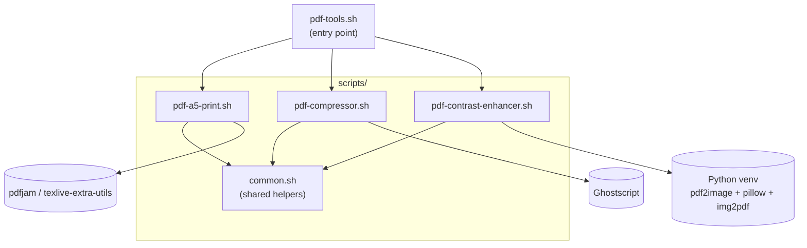

# pdf-tools

A collection of small interactive bash scripts for common PDF tasks. All scripts live in `scripts/` and share a common set of bash helpers (colored logging, drag-and-drop path cleanup, output-file prompts) via `scripts/common.sh`, so the tools stay consistent without duplicating the same prompt/logging logic three times.

## Quick start

Run everything through the single entry point, `pdf-tools.sh`:

```bash
./pdf-tools.sh
```

With no arguments it shows an interactive menu of all tools; pick one, and after it finishes you're back at the menu to run another (or `q` to quit). You can also jump straight to a tool, by name or number, skipping the menu:

```bash
./pdf-tools.sh compressor
./pdf-tools.sh 1          # a5-print
```

## Architecture

`pdf-tools.sh` is the top-level menu/dispatcher; each tool script it launches sources `scripts/common.sh` for its interactive prompts, logging, and progress-bar rendering, then shells out to its own external dependency to do the actual PDF work.



## Tools

Each tool can also be run standalone, without going through the menu:

### a5-print

Combines two A5 PDFs side by side onto a single A4 landscape page. Requires `pdfjam` from the `texlive-extra-utils` package:

```bash
sudo apt install texlive-extra-utils
./scripts/pdf-a5-print.sh
```

Prompts for the first A5 PDF, the second A5 PDF (press Enter to reuse the first file), and an output file name (defaults to `output_A4_landscape.pdf`).

### compressor

Compresses a PDF using Ghostscript, with a choice of three quality presets. Requires `ghostscript`:

```bash
sudo apt install ghostscript
./scripts/pdf-compressor.sh
```

Prompts for the input PDF, a compression level, and an output file name (defaults to `<original-name>_compressed.pdf`).

| # | Preset     | DPI | Description                    |
|---|------------|-----|---------------------------------|
| 1 | `screen`   |  72 | Smallest file, lowest quality   |
| 2 | `ebook`    | 150 | Moderate quality *(default)*    |
| 3 | `prepress` | 300 | Highest quality, larger file    |

Compression results vary depending on the source material — some PDFs may not shrink significantly.

### contrast-enhancer

Increases the contrast and sharpness of a PDF. Requires `python3`, `python3-venv`, and `poppler-utils`:

```bash
sudo apt install python3 python3-venv poppler-utils
./scripts/pdf-contrast-enhancer.sh
```

Missing packages are detected and installed automatically on first run. The script also creates a Python virtual environment at `~/.pdf-contrast-enhancer-venv` and installs the required Python packages (`pdf2image`, `pillow`, `img2pdf`) on first run.

Prompts for the input PDF and an output file name (defaults to `<original-name>_contrast.pdf`). Each page is rendered at 300 DPI, enhanced, and saved as JPEG (quality 85) before being reassembled into a PDF:

| Enhancement | Factor |
|-------------|--------|
| Contrast    | 2.5×   |
| Sharpness   | 1.5×   |

Output file size will be comparable to the original.

## Common behavior

All three tools share the same interaction style:

- File paths can be typed manually or dragged and dropped from a file manager (`~` expansion, quoted paths, and backslash-escaped spaces are all handled).
- If the output file already exists, you're prompted to overwrite it or choose a different name.
- Missing dependencies are detected on first run, with install instructions (or automatic installation, for the contrast-enhancer) printed to the terminal.
