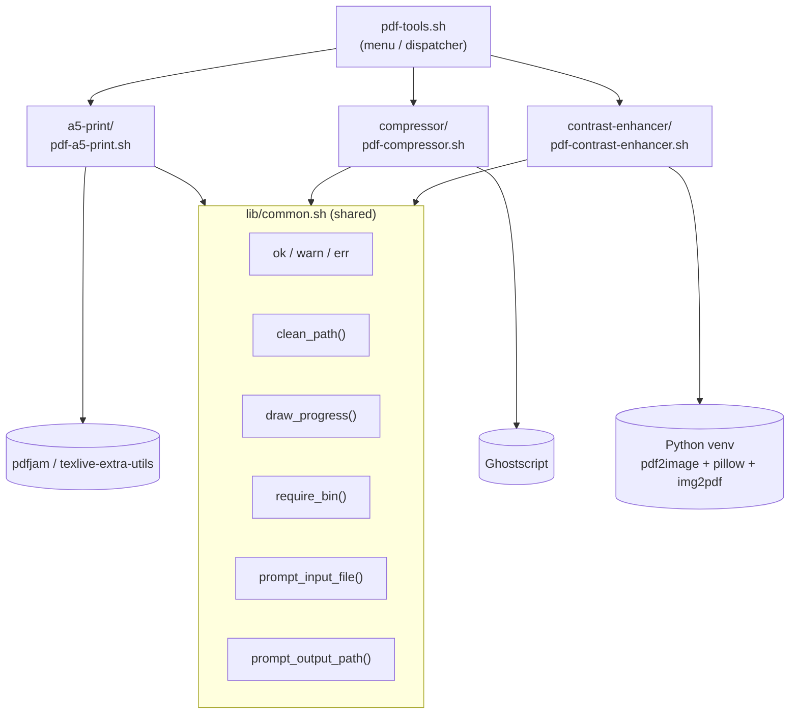

# pdf-tools

A collection of small interactive bash scripts for common PDF tasks. Each tool lives in its own directory and shares a common set of bash helpers (colored logging, drag-and-drop path cleanup, output-file prompts) via `lib/common.sh`, so the tools stay consistent without duplicating the same prompt/logging logic three times.

## Quick start

Run everything through the single entry point, `pdf-tools.sh`:

```bash
./pdf-tools.sh
```

With no arguments it shows an interactive menu of all tools; pick one, and after it finishes you're back at the menu to run another (or `q` to quit). You can also jump straight to a tool, by name or number, skipping the menu:

```bash
./pdf-tools.sh compressor
./pdf-tools.sh 1          # a5-print
```

## Architecture

`pdf-tools.sh` is the top-level menu/dispatcher; each tool script it launches sources `lib/common.sh` for its interactive prompts, logging, and progress-bar rendering, then shells out to its own external dependency to do the actual PDF work.



## Tools

Each tool can also be run standalone, from its own directory, instead of through `pdf-tools.sh`:

### [a5-print](a5-print/README.md)

Combines two A5 PDFs side by side onto a single A4 landscape page.

```bash
cd a5-print
./pdf-a5-print.sh
```

### [compressor](compressor/README.md)

Compresses a PDF using Ghostscript, with a choice of three quality presets.

```bash
cd compressor
./pdf-compressor.sh
```

### [contrast-enhancer](contrast-enhancer/README.md)

Increases the contrast and sharpness of a PDF.

```bash
cd contrast-enhancer
./pdf-contrast-enhancer.sh
```

## Common behavior

All three tools share the same interaction style:

- File paths can be typed manually or dragged and dropped from a file manager (`~` expansion, quoted paths, and backslash-escaped spaces are all handled).
- If the output file already exists, you're prompted to overwrite it or choose a different name.
- Missing dependencies are detected on first run, with install instructions (or automatic installation, for the contrast-enhancer) printed to the terminal.
