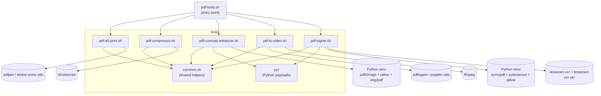

# PDF-tools

A collection of small interactive bash scripts for common PDF tasks. All tools live in `tools/` and share a common set of bash helpers (colored logging, drag-and-drop path cleanup, output-file prompts) via `tools/common.sh`, so the tools stay consistent without duplicating the same prompt/logging logic across tools.

## Tools

| Tool | What it does |
|------|---------------|
| [pdf-a5-print](#pdf-a5-print) | Combines two A5 PDFs side by side onto a single A4 landscape page |
| [pdf-compressor](#pdf-compressor) | Compresses a PDF with Ghostscript, using a quality preset or a target file size in MB |
| [pdf-contrast-enhancer](#pdf-contrast-enhancer) | Increases the contrast and sharpness of a scanned/photographed PDF |
| [pdf-to-video](#pdf-to-video) | Converts a PDF presentation into an MP4 slideshow video, one fixed-duration slide per page |
| [pdf-signer](#pdf-signer) | OCRs a scanned PDF for a signer's printed name and stamps a signature image next to it |

## Quick start

The tools target Debian/Ubuntu: dependency hints and auto-installs use `apt`.

Run everything through the single entry point, `pdf-tools.sh`:

```bash
./pdf-tools.sh
```

With no arguments it shows an interactive menu of all tools; pick one, and after it finishes you're back at the menu to run another (or `q` to quit). You can also jump straight to a tool, by name or number, skipping the menu:

```bash
./pdf-tools.sh pdf-compressor
./pdf-tools.sh 1          # pdf-a5-print
```

## Architecture

`pdf-tools.sh` is the top-level menu/dispatcher; each tool script it launches sources `tools/common.sh` for its interactive prompts, logging, and progress-bar rendering, then shells out to its own external dependency to do the actual PDF work.


```mermaid
graph TD
  Menu["pdf-tools.sh\n(entry point)"]

  subgraph Tools["tools/"]
    Common["common.sh\n(shared helpers)"]
    Py["py/\n(Python payloads)"]
    A5["pdf-a5-print.sh"]
    Compressor["pdf-compressor.sh"]
    Contrast["pdf-contrast-enhancer.sh"]
    ToVideo["pdf-to-video.sh"]
    Signer["pdf-signer.sh"]
  end

  Menu --> A5
  Menu --> Compressor
  Menu --> Contrast
  Menu --> ToVideo
  Menu --> Signer

  A5 --> Common
  Compressor --> Common
  Contrast --> Common
  ToVideo --> Common
  Signer --> Common

  A5 --> Pdfjam[("pdfjam / texlive-extra-utils")]
  Compressor --> Ghostscript[("Ghostscript")]
  Contrast --> Py
  Signer --> Py
  Contrast --> Venv[("Python venv\npdf2image + pillow + img2pdf")]
  ToVideo --> Pdftoppm[("pdftoppm / poppler-utils")]
  ToVideo --> Ffmpeg[("ffmpeg")]
  Signer --> SignerVenv[("Python venv\npymupdf + pytesseract + pillow")]
  Signer --> Tesseract[("tesseract-ocr + tesseract-ocr-ukr")]
```

## Tool details

Each tool can also be run standalone, without going through the menu:

### pdf-a5-print

Combines two A5 PDFs side by side onto a single A4 landscape page. Requires `pdfjam` from the `texlive-extra-utils` package:

```bash
sudo apt install texlive-extra-utils
./tools/pdf-a5-print.sh
```

Prompts for the first A5 PDF, the second A5 PDF (press Enter to reuse the first file), and an output file name (defaults to `output_A4_landscape.pdf`).

### pdf-compressor

Compresses a PDF using Ghostscript, with a choice of three quality presets or a target file size. Requires `ghostscript`:

```bash
sudo apt install ghostscript
./tools/pdf-compressor.sh
```

Prompts for the input PDF, a compression level, and an output file name (defaults to `<original-name>_compressed.pdf`).

| # | Preset     | DPI | Description                    |
|---|------------|-----|---------------------------------|
| 1 | `screen`   |  72 | Smallest file, lowest quality   |
| 2 | `ebook`    | 150 | Moderate quality *(default)*    |
| 3 | `prepress` | 300 | Highest quality, larger file    |
| 4 | `target`   | 30–300 | Highest quality that fits a size you enter (MB) |

With option 4 the tool binary-searches the highest image DPI whose result is at most the target size, running Ghostscript several times (each pass shows its own progress bar and resulting size). Only images are downsampled, so a text/vector-heavy PDF may not reach a small target; in that case the smallest result (30 dpi) is kept with a warning. If the input is already under the target, nothing is written.

Compression results vary depending on the source material — some PDFs may not shrink significantly.

### pdf-contrast-enhancer

Increases the contrast and sharpness of a PDF. Requires `python3`, `python3-venv`, and `poppler-utils`:

```bash
sudo apt install python3 python3-venv poppler-utils
./tools/pdf-contrast-enhancer.sh
```

Missing packages are detected and installed automatically on first run. The script also creates a Python virtual environment at `~/.pdf-contrast-enhancer-venv` and installs the required Python packages (`pdf2image`, `pillow`, `img2pdf`) on first run.

Prompts for the input PDF and an output file name (defaults to `<original-name>_contrast.pdf`). Each page is rendered at 300 DPI, enhanced, and saved as JPEG (quality 85) before being reassembled into a PDF:

| Enhancement | Factor |
|-------------|--------|
| Contrast    | 2.5×   |
| Sharpness   | 1.5×   |

Output file size will be comparable to the original.

### pdf-to-video

Converts a PDF presentation into an MP4 slideshow video, showing each page for a fixed number of seconds. Requires `poppler-utils` and `ffmpeg`:

```bash
sudo apt install poppler-utils ffmpeg
./tools/pdf-to-video.sh
```

Prompts for the input PDF, seconds per slide (default: 5), and an output file name (defaults to `<original-name>_slideshow.mp4`).

Each page is rendered at 150 DPI and encoded into a 1920x1080 letterboxed H.264/yuv420p video for broad TV/USB playback compatibility.

### pdf-signer

OCRs a scanned PDF (no text layer needed) looking for a signer's printed name, then stamps a signature image just to its left, vertically centered. Pages are checked from the last page backward, stopping at the first match. Requires `python3`, `python3-venv`, `tesseract-ocr`, and `tesseract-ocr-ukr`:

```bash
sudo apt install python3 python3-venv tesseract-ocr tesseract-ocr-ukr
./tools/pdf-signer.sh
```

Missing packages are detected and installed automatically on first run. The script also creates a Python virtual environment at `~/.pdf-signer-venv` and installs the required Python packages (`pymupdf`, `pytesseract`, `pillow`) on first run.

Prompts for a signature image (PNG, ideally with a transparent background), the signer's full name, an input PDF **or a folder of PDFs** (batch mode), an output path, and placement tuning (gap, signature height, extra horizontal shift — all in points, with sensible defaults). In batch mode every `.pdf` in the input folder is signed into the output folder under the same filename; a failure on one file is reported and doesn't stop the rest of the batch.

OCR is currently tuned for Ukrainian names (`tesseract-ocr-ukr`); matching is done by prefix, so Ukrainian case endings (e.g. СЕДУН / СЕДУНУ / СЕДУНА) still match.

## Common behavior

All tools share the same interaction style:

- File paths can be typed manually or dragged and dropped from a file manager (`~` expansion, quoted paths, and backslash-escaped spaces are all handled).
- If the output file already exists, you're prompted to overwrite it or choose a different name.
- Missing dependencies are detected on first run, with install instructions (or automatic installation, for the contrast-enhancer and signer) printed to the terminal.

## Development

There's no build system or automated test suite — this is plain bash plus small Python scripts (in `tools/py/`, run by `pdf-contrast-enhancer.sh` and `pdf-signer.sh`). Verify a change by running the affected tool end-to-end:

```bash
./pdf-tools.sh                    # interactive menu
./pdf-tools.sh pdf-compressor     # jump straight to a tool by key
./tools/pdf-compressor.sh         # or run a tool standalone, bypassing the menu
```

For fast static checks that don't execute anything or need the PDF tools installed:

```bash
./check.sh
```

This runs `bash -n`, `shellcheck` and `shfmt -d` on every script, repo-specific convention checks (`checks/conventions.sh`), and a syntax + `ruff` (lint and format) + `pyright` pass over `tools/py/*.py` and `tests/py/*.py` (`checks/python.sh`). `shellcheck` and `shfmt` (`sudo apt install shellcheck shfmt`) and `ruff` and `pyright` (`pip install ruff pyright`) are optional locally — a missing one is skipped with a warning — but set `CI=1` to make a missing tool a failure. Fix formatting with `shfmt -w` and `ruff format tools/py tests/py`.

Unit tests for the signer's pure logic (name matching, signature placement, batch handling) live in `tests/py/` and run with:

```bash
./test.sh                # all tests
./test.sh -k locate -x   # extra arguments go to pytest
```

`test.sh` runs pytest in the signer's venv (`~/.pdf-signer-venv`) and installs pytest there the first time; it needs `python3`, `python3-venv` and network access only for that first run. Tesseract isn't needed, since the tests use fake OCR data.

### Adding a tool

1. Create `tools/pdf-<name>.sh`, sourcing `common.sh` (see an existing tool for the dependency check → prompts → run shape). Python payloads go in `tools/py/pdf-<name>.py`, not heredocs.
2. Register it in the three parallel arrays (`TOOL_KEYS`, `TOOL_LABELS`, `TOOL_SCRIPTS`) in `pdf-tools.sh`.
3. Add any default output filename pattern to `.gitignore`, and a row, section and diagram node to this README.

`./check.sh` enforces steps 1–2.
